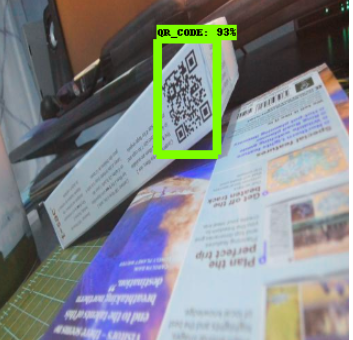
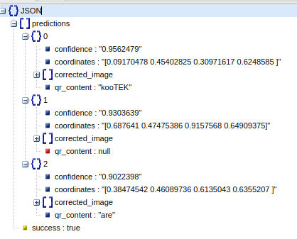

# QR_detection
QR detection, orientation and decode

# Detection

For QR detection, I decided to use a Deep Learning approach. I used the Object Detection API from tensorflow. As this is a problem where we need to detect a single class, I used a SSD detector, due to its fast response.

I trained the detector using Pascal VOC annotation. For further information about the training process, please refer to the notebook QR_detector.
I used Google colab for the training process. So, if you want to train your own model, the notebook is straight forward to follow.

The trickiest part is to figure out how to install the Object Detection API for tensorflow 2.X. Don't worry, everything is explained in the notebook.

## Data used

I used open data from the website roboflow. It is already labeled. I just needed to create a few lines of code to adapt it for training.
This is also explained in the QR_detector notebook.

## Detection results

After around 20min of training (15k steps) using Google Colab GPU, we arrived to a Total Loss function of 0.18. In the next images, you can see a few examples.

# QR Orientation

To correct the orientation of the detected QR codes, I decided to use Image Processing Techniques. Here are some reasons why: 

* We are dealing with basic geometry.
* We do not need an RGB image, grayscale is enough.
* QR codes have orientation identifiers. Three squares in the corners. North West, North East and South West. These identifiers are called "Finder Patterns".

In order to get the correct angle orientation, we need to follow these steps:

* Image Preprocess
* Finder Patterns Detection
* QR orientation Given Finder Patterns

## Preprocess

The processes used were:

* Equalization using CLAHE.
* Binarization
* Edge detection

All these steps are better explained in the QR_rotation notebook. Here some images to visualize the steps.

## Finder Patterns

To reach these task, we must do:

* Detect Contours
* Detect 4-sides figures
* Retain possible Finder Patterns

## QR orientation

Now that we detected the finder patterns, we just need to fix the orientation. However, this is not a trivial task.

* Detect center of finder patterns.
* Detect North West finder pattern.
* Rotate QR

**In implementation, once this QR code is well oriented, it will be returned as a base64 image.**

# QR decode

I used the library pyzbar is a wrapper to the zbar application. Which is robust to decode barcodes. 

# Web Service

Now that we have detection, orientation and decode, we must integrate them into a web service.
This is the main objective of this repository.

This implementation was inspired by  [this amazing tutorial](https://pyimagesearch.com/2018/02/05/deep-learning-production-keras-redis-flask-apache/) from Pyimagesearch website.

We basically follow the next structure.

We need to install Redis. We use these non-relational database to queue the requests. Let's say we have 500 request per second, it would be a good idea to use a GPU.
So if we process a batch of images, instead of an image a time, we'll use the best performance for inference. That's why this structure it's right to implement.

Note: If we want to process batches, all images must be the same size.

In general, this service is broke down in two essential pieces.

* run_web_server.py
* run_dl_service.py

One service starts receiving images and send them to the queue.
The other one, starts processing qr detection, orientation and decode. Once is finished, it returns the result to the queue and the web service return the output to the client.

To make this code work, we must run the 2 services and give 2 env variables.

PATH_TO_LABELS_QR: Refers to a labelmap.pbtxt file that contains the labels for the QR detector.
PATH_TO_MODEL_QR: Refers to the QR detector model.

Note: The written code follows PEP8 standard and Google Docstrings format.

# Requests

Now that both services are running, we can run a POST query to our service.

In the QR_request notebook  is better explained.

For facilities, a postman collection is given.

Here we can see a result example:

Visualization of original image and detected QR-codes.

# Further steps

* In order to detect errors; create unit tests. This step is crucial before setting into production.
* To make this code run in a proper manner (production level), we must create a service through nginx or apache.
* Create a docker container to run the services. Use docker compose to run redis database in a separate environment.
* Mount it in a cloud service.
